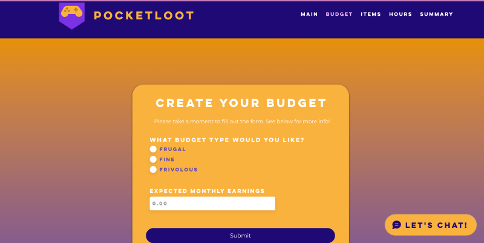

Project for [Pearl Hacks 2023](https://pearlhacks2023.devpost.com/)

Awarded: Best Domain Name from Domain.com

## Overview
Nowadays, plenty of games on the market find themselves utilizing the "free to play" model. However, most games aren't very wallet-friendly after all with the secretly embedded microtransactions and add-ons to purchase. PocketLoot is a user-friendly web app for gamers to budget their spending on such games, and become more mindful of their finances.

## Development
This gamer's budgeting tool was developed using [Velo by Wix](https://www.wix.com/velo), a full-stack web development platoform, and utilized JavaScript to create the framework of the website. Canva was used to create graphics such as the logo. The domain was from domain.com.

Pocketloot keeps track of the amount of money that is spent per game, and how much time is spent per game. It also allows users to view a summary chart of all their finances. Users are able to create a budget to help them stay within spending limits. 

<!--more-->

## Further Thoughts
With the time constraint of 24 hours, Velo by Wix streamlined the process of creating the framework of the website so my teammates and I could spend time focusing on intuitive UI design and special features. 

I was happy to contribute to this project since this is the first web development focused project I have worked on. 

View the DevPost page [here](https://devpost.com/software/pocketloot).